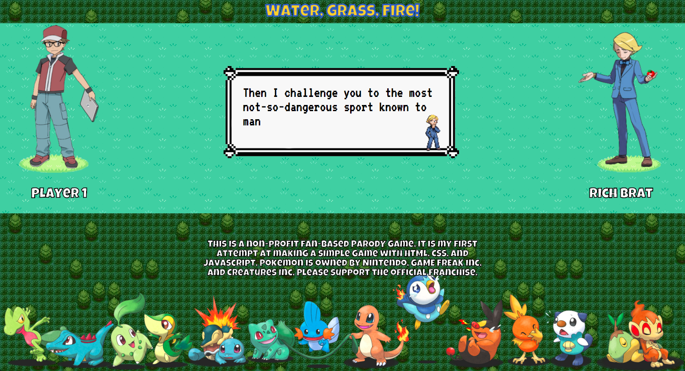
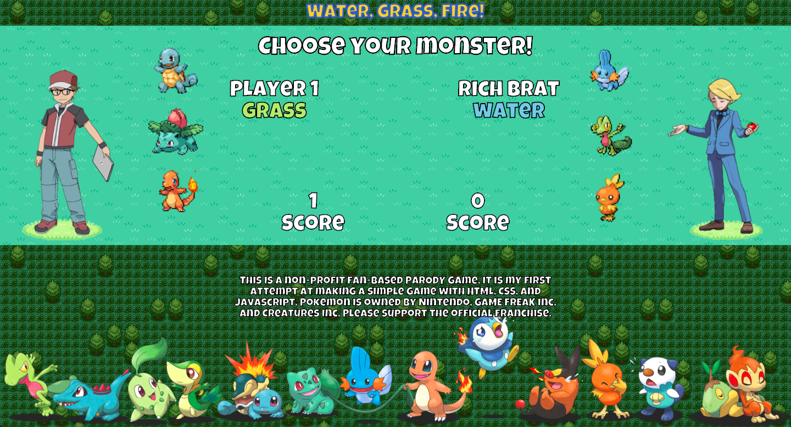
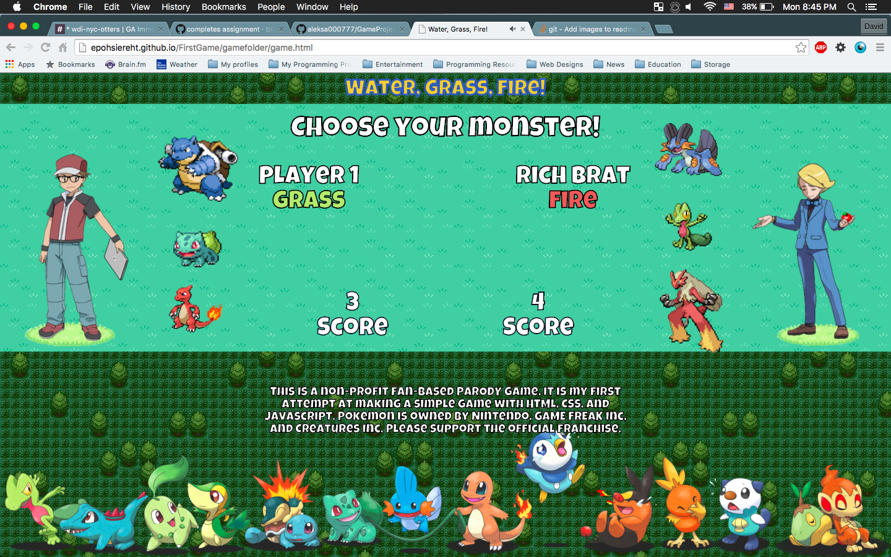

<strong>Water, Grass, Fire!!!!!</strong> 
 
http://epohsiereht.github.io/FirstGame/  
 
This is a simple game of Rock, Paper, Scissors but with a twist.
You're going to replace rock, paper, scissors with the water, grass, and fire elements from Poke'mon  

<strong>The rules are simple:</strong> 
<strong>1. Choose your monster element and get points.</strong> 
<strong>2. Win 5 games to beat the oponent.</strong> 
<strong>3. Have fun :) </strong> 
Note: 
Water > Fire  
Grass > Water  
Fire > Grass  
 
 
You can also evolve your monster!! 
 
 
  
Start with the intro.html file! 
 
 
Technologies Used: 
<li>HTML5</li>
<li>CSS3</li>
<li>JavaScript with jQuery</li>
